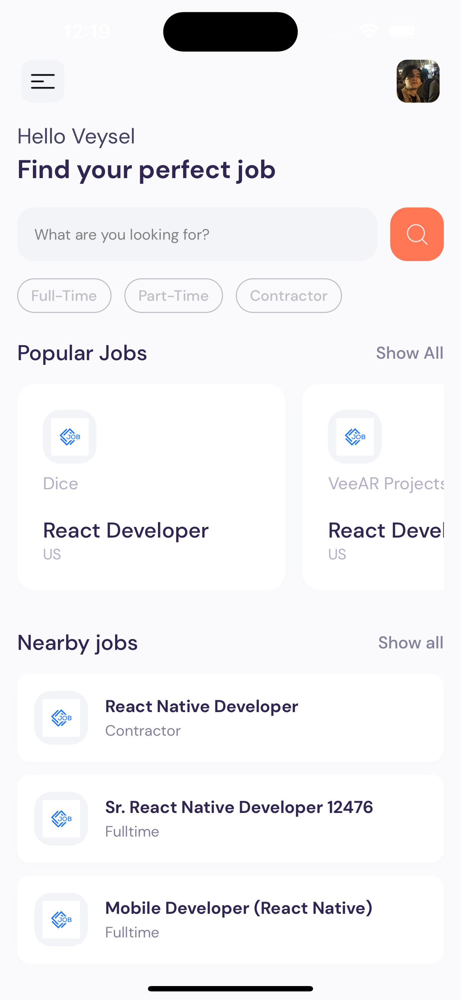
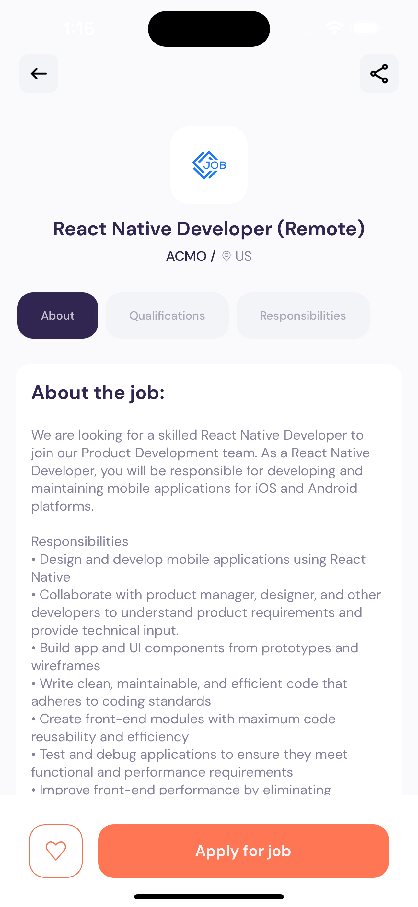

# Jobs 

- develop visually appealing UI/UX designs
- fetch data from an external API and integrate it
- implement search & pagination functionality
- create customAPI data fetching hooks
- write clean, organized, and maintainable code with proper architecture
- follow the best practices for React Native development

### Screenshots

